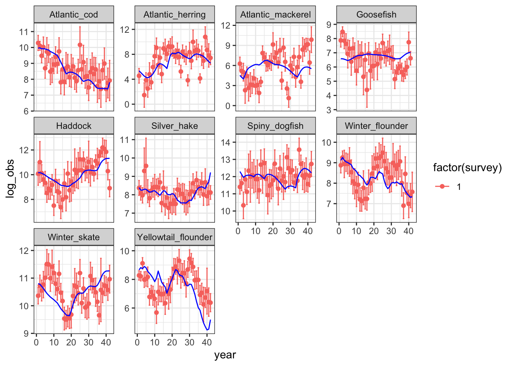
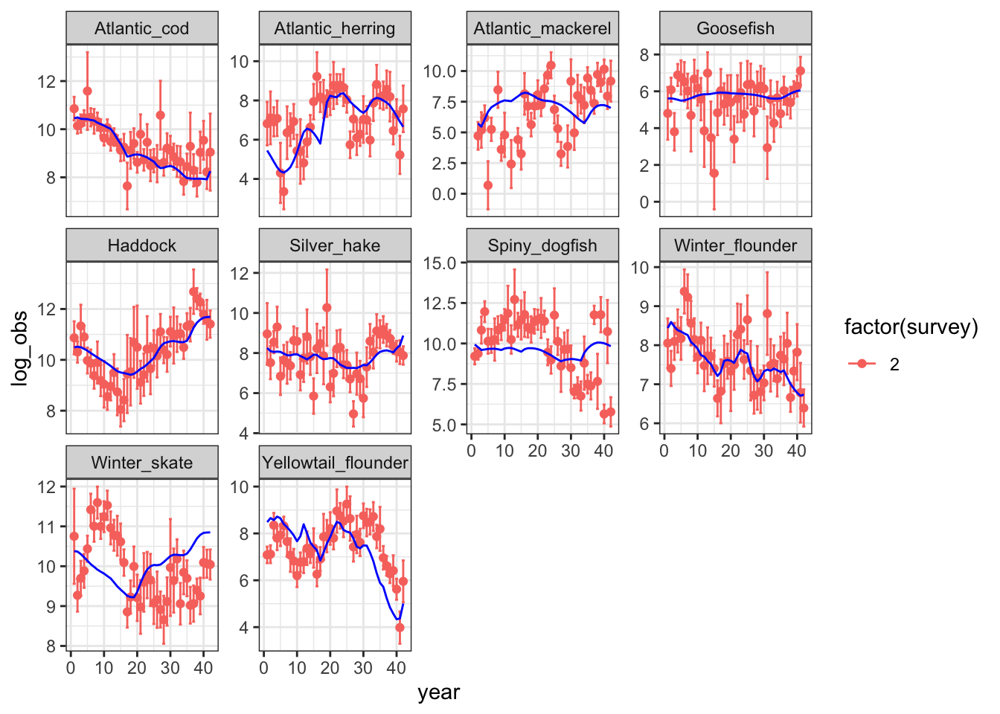
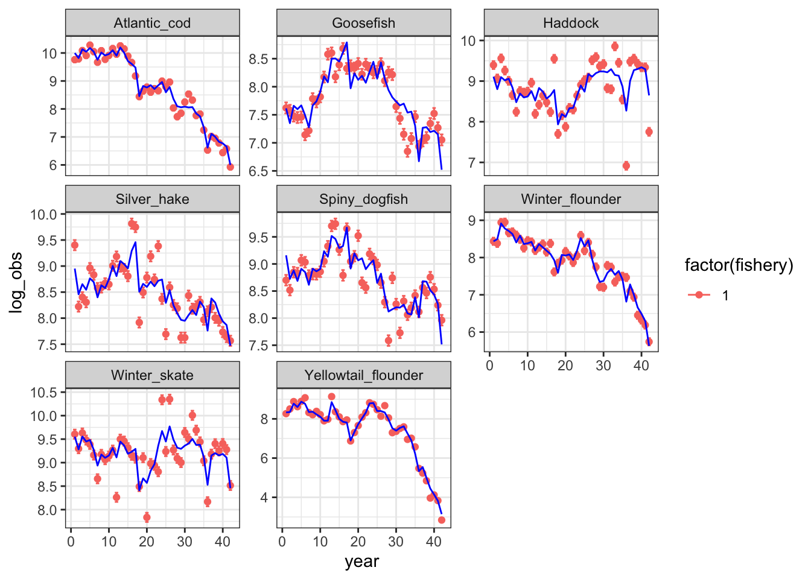
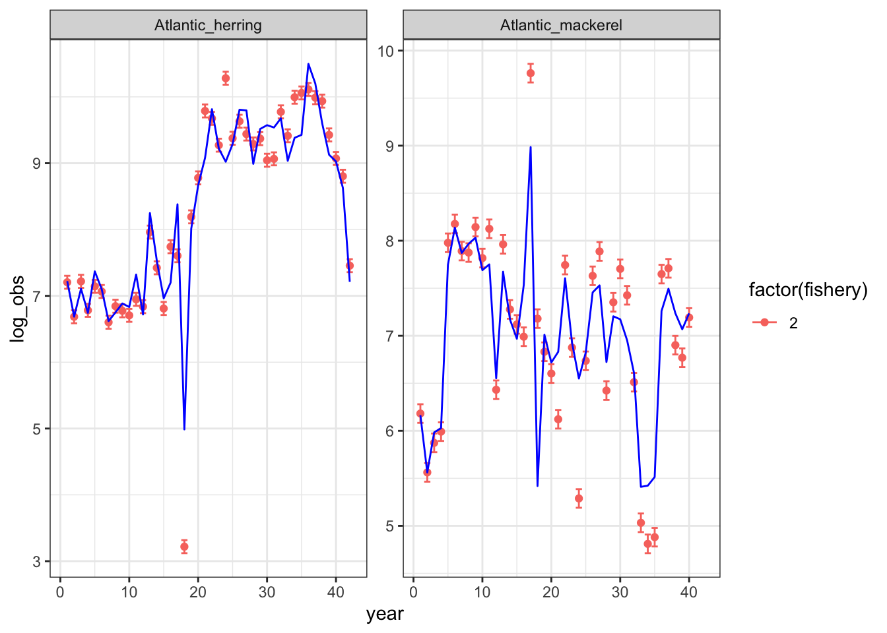
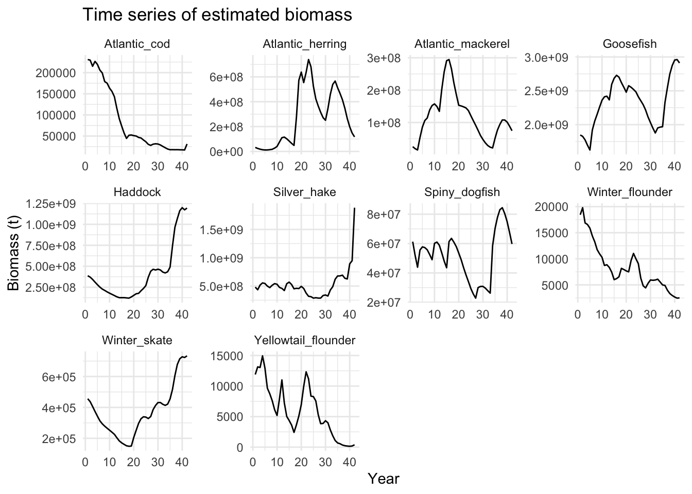
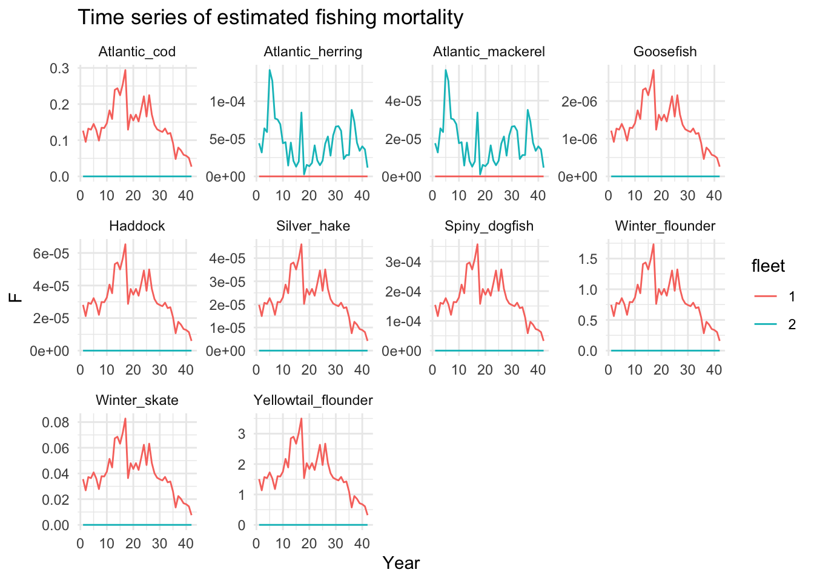
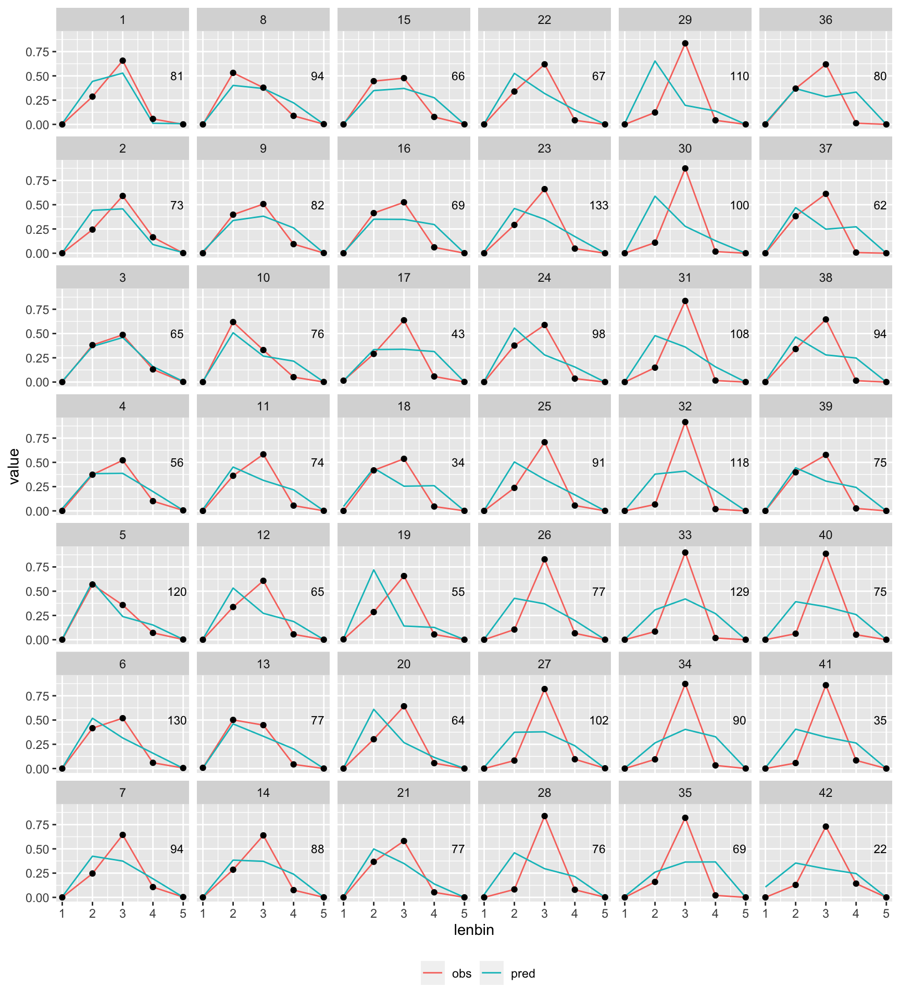
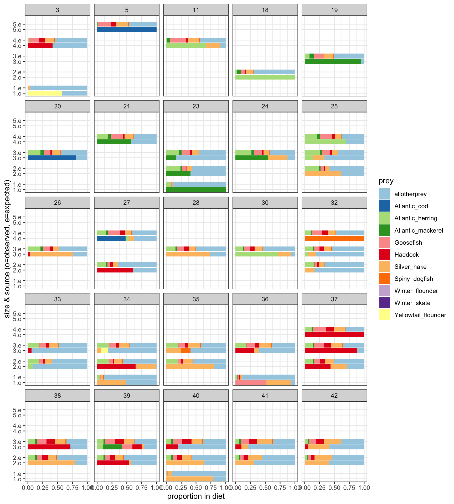
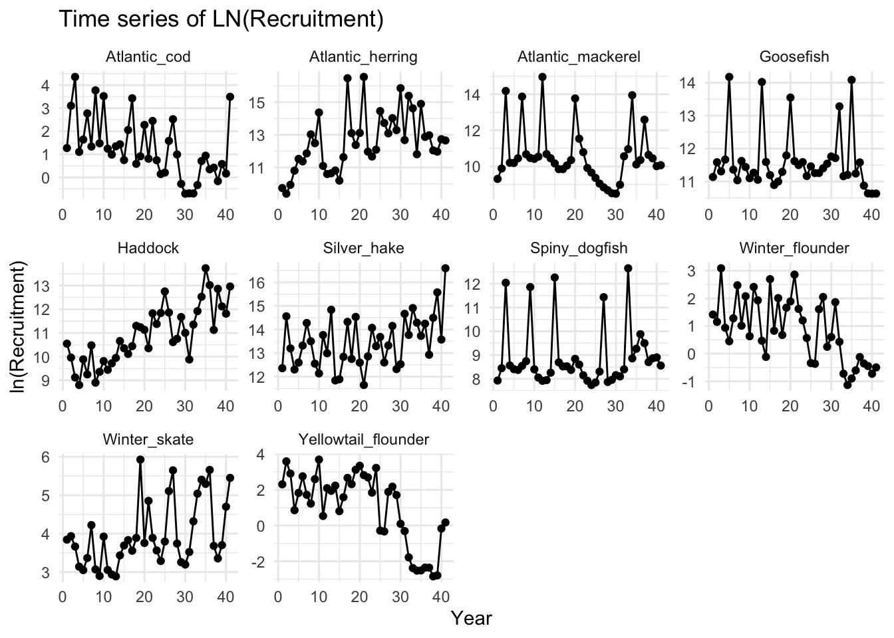

## Introduction

Hydra model equations, new objective function equations, and descriptions of initial modeling approaches and diagnostics are found in the Hydra Methodology document. An overview of results presented during the ICES WGSAM 2022 meeting under ToR b, keyrun reviews, is included in this document. 

Hydra model diagnostics and progress fitting to three datasets were be presented: 

*  Simulated data with 5 length bins  
*  Simulated data with 10 length bins  
*  Georges Bank data with 5 length bins

We use 5 length bins as a starting structure for fitting the Georges Bank data because the simulation model Hydra used 5 length bins. We do not consider any of these models fully converged as keyruns, rather the diagnostics with each dataset are intended to give insight into model behavior and performance. 

Specifically, the simulated datasets with different numbers of length bins are intended to evaluate model sensitivity to this choice of input data structure and tradeoffs with overall performance. These datasets also allow preliminary comparisons with true Atlantis quantities (biomass, recruitment, diet) as a step towards skill assessment. Sensitivity of the model to the Other food parameter was identified as a high priority in the 2018 simulation model review, and is being evaluated with the simulated dataset. Initial fits to different levels of other food with simulated data were posted, but not presented at the meeting due to time constraints.

Fits to the real Georges Bank data have just begun, and have already highlighted several implicit assumptions in the Hydra model code that have been addressed. The time period for modeling has been adjusted to 1978-2019 to avoid starting the model with extremely high catches observed 1968-1977. 

Three sets of Georges Bank fits were presented, including:

*  Estimate only average F, no initial N or recruitment deviations  
*  Estimate average F and initial N, no recruitment deviations  
*  Estimate all  

## Results

**These fits are shown to illustrate initial model performance. Neither the model code nor the data inputs are considered final.** 

Overall, the results of initial fitting are encouraging, considering that Hydra has only recently been developed as an estimation model, and the datasets continue to be refined as well. We note that interannual variability has been picked up by the model for lots of stocks in both simulated and real datasets, suggesting that the model is able to respond to input data. The fits and other outputs shown here are from the model "estimate-all" presented 11 October 2022.

However, it is clear that there is a challenge estimating scale for some stocks. In particular, Georges Bank pelagics (Atlantic herring and Atlantic mackerel), scale is problematic, and estimated F is very low. This is also true for yellowtail flounder (notably, single stock assessment for this stock on Georges Bank is difficult as well).

Fits to annual size composition in these initial attempts are poor, and turning off diet composition during fitting doesn’t affect general model behavior too much. 

Model estimated recruitment deviations show patterns that are unlikely given species life history (e.g. spiny dogfish).

To begin addressing where fitting issues are happening, a series of runs are in progress with Georges Bank data sequentially turning on different portions of the estimation. In addition, fits to simulated data are in progress to determine the impacts of different length bin specification on model estimation performance. Finally, sensitivity analysis has started looking at different levels of OtherFood using simulated datasets. Results from all of these analyses in progress were available during the review. 

\newpage

## Next steps

Initial skill assessment and initial fits to GB mskeyrun data suggest Hydra is responsive to data sets. However, ongoing modeling work is designed to get more of a feel for how this model is behaving when confronted with data. 

Potential topics for discussion with reviewers include:

*   Mismatch between drivers of trends and spatial resolution (subsets of stock being included for pelagics)  
*   Generic structure of length bin parameterization  
*   Fishing fleet specification   
*   Fits to all species together rather than starting from results of single-species  
*   Predation mortality component estimation  
*   Data weighting  
*   Simulation testing (self-tests, fits to Atlantis)   
*   Move to TMB (state space) framework (Rceattle?) 
*   Application as a multispecies assessment model  
*   How precise do the growth functions need to be? (i.e. reliance on age/growth studies)  
*   How do growth model choices (structure) affect performance  

